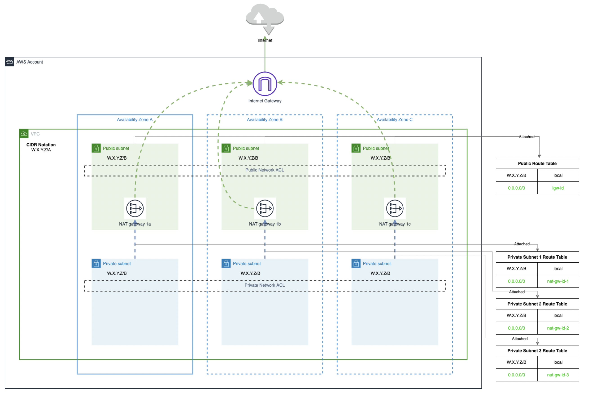

## AWS VPC Terraform module
Terraform module which creates VPC resources on AWS acording to the following architecture diagram:



## Usage

```hcl
module "vpc" {
  source = "git::https://github.com/martincastrocm/tf-aws-vpc.git?ref=v1.0.0"
  name   = "test"
}
```

## Examples

- [Simple](https://github.com/martincastrocm/tf-aws-vpc/tree/master/examples/simple).
- [Custom Settings](https://github.com/martincastrocm/tf-aws-vpc/tree/master/examples/cusom-settings).

<!-- BEGIN_TF_DOCS -->
## Requirements

| Name | Version |
|------|---------|
| <a name="requirement_terraform"></a> [terraform](#requirement\_terraform) | >= 1.8.5 |
| <a name="requirement_aws"></a> [aws](#requirement\_aws) | >= 5.53.0 |

## Providers

| Name | Version |
|------|---------|
| <a name="provider_aws"></a> [aws](#provider\_aws) | >= 5.53.0 |

## Modules

No modules.

## Resources

| Name | Type |
|------|------|
| [aws_eip.nat](https://registry.terraform.io/providers/hashicorp/aws/latest/docs/resources/eip) | resource |
| [aws_internet_gateway.this](https://registry.terraform.io/providers/hashicorp/aws/latest/docs/resources/internet_gateway) | resource |
| [aws_nat_gateway.this](https://registry.terraform.io/providers/hashicorp/aws/latest/docs/resources/nat_gateway) | resource |
| [aws_network_acl.private](https://registry.terraform.io/providers/hashicorp/aws/latest/docs/resources/network_acl) | resource |
| [aws_network_acl.public](https://registry.terraform.io/providers/hashicorp/aws/latest/docs/resources/network_acl) | resource |
| [aws_network_acl_rule.private_inbound](https://registry.terraform.io/providers/hashicorp/aws/latest/docs/resources/network_acl_rule) | resource |
| [aws_network_acl_rule.private_outbound](https://registry.terraform.io/providers/hashicorp/aws/latest/docs/resources/network_acl_rule) | resource |
| [aws_network_acl_rule.public_inbound](https://registry.terraform.io/providers/hashicorp/aws/latest/docs/resources/network_acl_rule) | resource |
| [aws_network_acl_rule.public_outbound](https://registry.terraform.io/providers/hashicorp/aws/latest/docs/resources/network_acl_rule) | resource |
| [aws_route.private_nat_gateway](https://registry.terraform.io/providers/hashicorp/aws/latest/docs/resources/route) | resource |
| [aws_route.public_internet_gateway](https://registry.terraform.io/providers/hashicorp/aws/latest/docs/resources/route) | resource |
| [aws_route_table.private](https://registry.terraform.io/providers/hashicorp/aws/latest/docs/resources/route_table) | resource |
| [aws_route_table.public](https://registry.terraform.io/providers/hashicorp/aws/latest/docs/resources/route_table) | resource |
| [aws_route_table_association.private](https://registry.terraform.io/providers/hashicorp/aws/latest/docs/resources/route_table_association) | resource |
| [aws_route_table_association.public](https://registry.terraform.io/providers/hashicorp/aws/latest/docs/resources/route_table_association) | resource |
| [aws_subnet.private](https://registry.terraform.io/providers/hashicorp/aws/latest/docs/resources/subnet) | resource |
| [aws_subnet.public](https://registry.terraform.io/providers/hashicorp/aws/latest/docs/resources/subnet) | resource |
| [aws_vpc.this](https://registry.terraform.io/providers/hashicorp/aws/latest/docs/resources/vpc) | resource |
| [aws_availability_zones.available](https://registry.terraform.io/providers/hashicorp/aws/latest/docs/data-sources/availability_zones) | data source |

## Inputs

| Name | Description | Type | Default | Required |
|------|-------------|------|---------|:--------:|
| <a name="input_name"></a> [name](#input\_name) | Name to be used on all the resources as identifier | `string` | `""` | no |
| <a name="input_subnets"></a> [subnets](#input\_subnets) | Subnets configuration. This object contains the following parameters:<br>- azs: A list of availability zones to create subnets in. Takes precedence over az\_number.<br>- az\_number: The number of availability zones to use if azs is not provided.<br>- public: Configuration for public subnets.<br>  - cidrs: A list of CIDR blocks for the public subnets.<br>  - suffix: A suffix to add to the name of the public subnets.<br>  - map\_public\_ip\_on\_launch: Whether to assign a public IP to instances launched in the public subnets. <br>  - tags: A map of tags to assign to the public subnets. Defaults to an empty map.<br>  - inbound\_acl\_rules: A list of inbound network ACL rules for the public subnets.<br>  - outbound\_acl\_rules: A list of outbound network ACL rules for the public subnets.<br>- private: Configuration for private subnets.<br>  - cidrs: A list of CIDR blocks for the private subnets.<br>  - suffix: A suffix to add to the name of the private subnets.<br>  - map\_public\_ip\_on\_launch: Whether to assign a public IP to instances launched in the private subnets.<br>  - tags: A map of tags to assign to the private subnets.<br>  - inbound\_acl\_rules: A list of inbound network ACL rules for the private subnets.<br>  - outbound\_acl\_rules: A list of outbound network ACL rules for the private subnets. | <pre>object({<br>    azs       = optional(list(string), [])<br>    az_number = optional(number, 1)<br>    public = optional(object({<br>      cidrs                   = optional(list(string), [])<br>      suffix                  = optional(string, "public")<br>      map_public_ip_on_launch = optional(bool, false)<br>      tags                    = optional(map(string), {})<br>      inbound_acl_rules = optional(list(map(string)), [<br>        {<br>          rule_number = 100<br>          rule_action = "allow"<br>          from_port   = 0<br>          to_port     = 0<br>          protocol    = "-1"<br>          cidr_block  = "0.0.0.0/0"<br>        },<br>      ])<br>      outbound_acl_rules = optional(list(map(string)), [<br>        {<br>          rule_number = 100<br>          rule_action = "allow"<br>          from_port   = 0<br>          to_port     = 0<br>          protocol    = "-1"<br>          cidr_block  = "0.0.0.0/0"<br>        },<br>      ])<br>      }),<br>      {<br>        cidrs                   = []<br>        suffix                  = "public"<br>        map_public_ip_on_launch = false<br>        tags                    = {}<br>        inbound_acl_rules = [<br>          {<br>            rule_number = 100<br>            rule_action = "allow"<br>            from_port   = 0<br>            to_port     = 0<br>            protocol    = "-1"<br>            cidr_block  = "0.0.0.0/0"<br>          },<br>        ]<br>        outbound_acl_rules = [<br>          {<br>            rule_number = 100<br>            rule_action = "allow"<br>            from_port   = 0<br>            to_port     = 0<br>            protocol    = "-1"<br>            cidr_block  = "0.0.0.0/0"<br>          },<br>        ]<br>      }<br>    )<br>    private = optional(object({<br>      cidrs                   = optional(list(string), [])<br>      suffix                  = optional(string, "private")<br>      map_public_ip_on_launch = optional(bool, false)<br>      tags                    = optional(map(string), {})<br>      inbound_acl_rules = optional(list(map(string)), [<br>        {<br>          rule_number = 100<br>          rule_action = "allow"<br>          from_port   = 0<br>          to_port     = 0<br>          protocol    = "-1"<br>          cidr_block  = "0.0.0.0/0"<br>        },<br>      ])<br>      outbound_acl_rules = optional(list(map(string)), [<br>        {<br>          rule_number = 100<br>          rule_action = "allow"<br>          from_port   = 0<br>          to_port     = 0<br>          protocol    = "-1"<br>          cidr_block  = "0.0.0.0/0"<br>        },<br>      ])<br>      }),<br>      {<br>        cidrs  = []<br>        suffix = "private"<br>        tags   = {}<br>        inbound_acl_rules = [<br>          {<br>            rule_number = 100<br>            rule_action = "allow"<br>            from_port   = 0<br>            to_port     = 0<br>            protocol    = "-1"<br>            cidr_block  = "0.0.0.0/0"<br>          },<br>        ]<br>        outbound_acl_rules = [<br>          {<br>            rule_number = 100<br>            rule_action = "allow"<br>            from_port   = 0<br>            to_port     = 0<br>            protocol    = "-1"<br>            cidr_block  = "0.0.0.0/0"<br>          },<br>        ]<br>      }<br>    )<br>  })</pre> | <pre>{<br>  "az_number": 1,<br>  "azs": [],<br>  "private": {<br>    "cidrs": [],<br>    "inbound_acl_rules": [<br>      {<br>        "cidr_block": "0.0.0.0/0",<br>        "from_port": 0,<br>        "protocol": "-1",<br>        "rule_action": "allow",<br>        "rule_number": 100,<br>        "to_port": 0<br>      }<br>    ],<br>    "map_public_ip_on_launch": false,<br>    "outbound_acl_rules": [<br>      {<br>        "cidr_block": "0.0.0.0/0",<br>        "from_port": 0,<br>        "protocol": "-1",<br>        "rule_action": "allow",<br>        "rule_number": 100,<br>        "to_port": 0<br>      }<br>    ],<br>    "suffix": "private",<br>    "tags": {}<br>  },<br>  "public": {<br>    "cidrs": [],<br>    "inbound_acl_rules": [<br>      {<br>        "cidr_block": "0.0.0.0/0",<br>        "from_port": 0,<br>        "protocol": "-1",<br>        "rule_action": "allow",<br>        "rule_number": 100,<br>        "to_port": 0<br>      }<br>    ],<br>    "map_public_ip_on_launch": false,<br>    "outbound_acl_rules": [<br>      {<br>        "cidr_block": "0.0.0.0/0",<br>        "from_port": 0,<br>        "protocol": "-1",<br>        "rule_action": "allow",<br>        "rule_number": 100,<br>        "to_port": 0<br>      }<br>    ],<br>    "suffix": "public",<br>    "tags": {}<br>  }<br>}</pre> | no |
| <a name="input_tags"></a> [tags](#input\_tags) | A map of tags to add to all resources | `map(string)` | `{}` | no |
| <a name="input_vpc"></a> [vpc](#input\_vpc) | VPC configuration. This object contains the following parameters:<br>- cidr: The CIDR block for the VPC. Defaults to "10.0.0.0/16".<br>- enable\_dns\_hostnames: Whether to enable DNS hostnames for instances within the VPC. Defaults to true.<br>- enable\_dns\_support: Whether to enable DNS support within the VPC. Defaults to true.<br>- tags: A map of tags to assign to the VPC. Defaults to an empty map. | <pre>object({<br>    cidr                 = optional(string, "10.0.0.0/16")<br>    enable_dns_hostnames = optional(bool, true)<br>    enable_dns_support   = optional(bool, true)<br>    tags                 = optional(map(string), {})<br>  })</pre> | <pre>{<br>  "cidr": "10.0.0.0/16",<br>  "enable_dns_hostnames": true,<br>  "enable_dns_support": true,<br>  "tags": {}<br>}</pre> | no |

## Outputs

| Name | Description |
|------|-------------|
| <a name="output_azs"></a> [azs](#output\_azs) | AZs deployed |
| <a name="output_igw_id"></a> [igw\_id](#output\_igw\_id) | Internet Gateway information |
| <a name="output_nat_gw_az_map"></a> [nat\_gw\_az\_map](#output\_nat\_gw\_az\_map) | AZ-NAT Gateway map information |
| <a name="output_private_subnets_az_map"></a> [private\_subnets\_az\_map](#output\_private\_subnets\_az\_map) | AZ-private subnet map information |
| <a name="output_public_subnets_az_map"></a> [public\_subnets\_az\_map](#output\_public\_subnets\_az\_map) | AZ-public subnet map information |
| <a name="output_vpc"></a> [vpc](#output\_vpc) | VPC information |
<!-- END_TF_DOCS -->